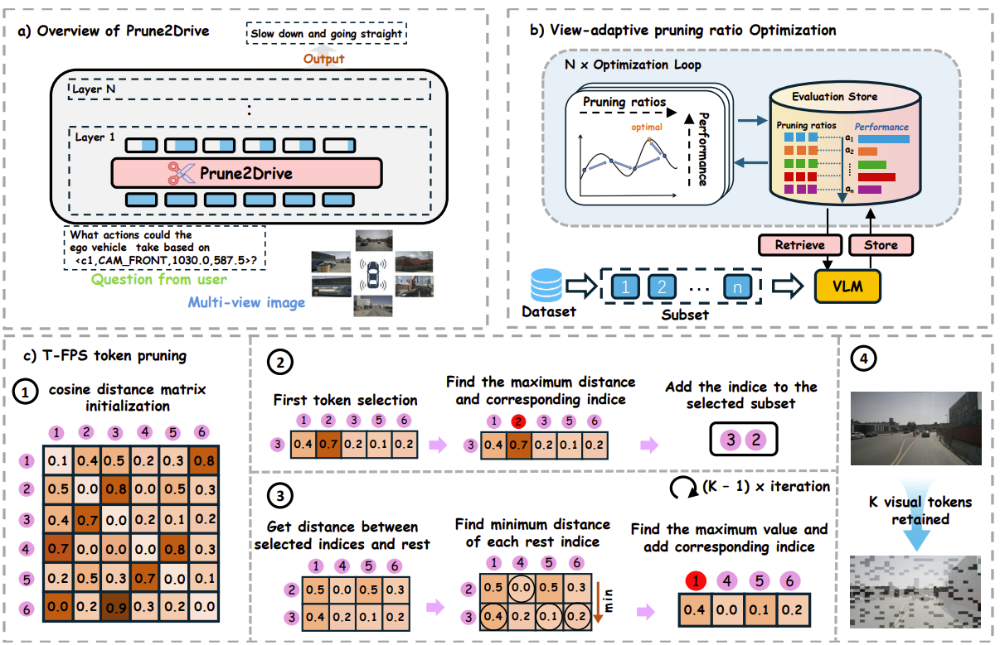
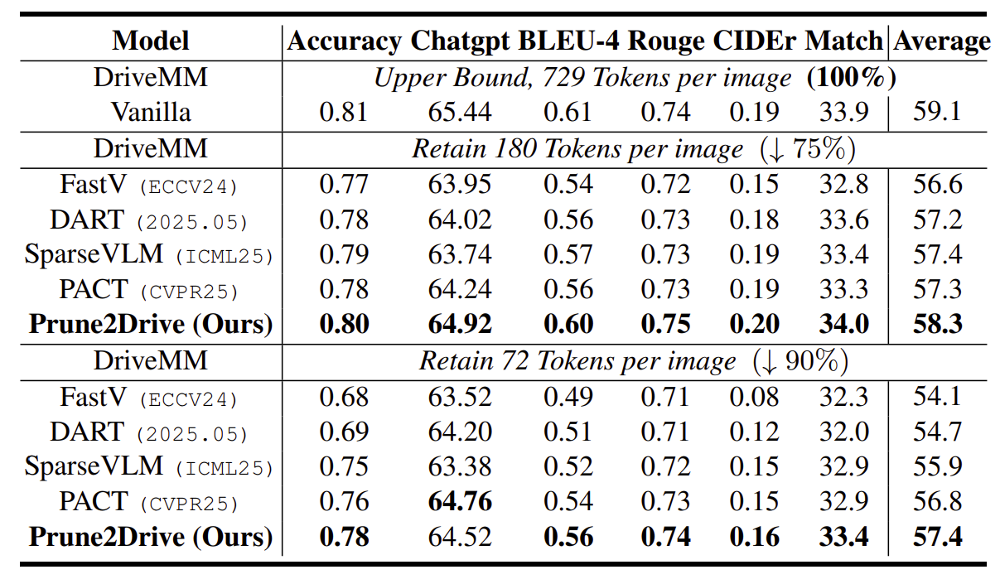
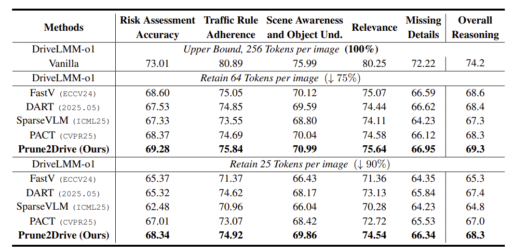

<div align="center">
  <h1 style="display: inline-block; margin: 0;">🚗 Prune2Drive: A Plug-and-Play Framework for Accelerating Vision-Language Models in Autonomous Driving</h1>
</div>

<h4 align="center"> 

[Minhao Xiong]()<sup>1*</sup>,
[Zichen Wen](https://scholar.google.com/citations?user=N-aPFvEAAAAJ&hl=zh-CN)<sup>1,2*</sup>,
[Zhuangcheng Gu]()<sup>3</sup>,
[Xuyang Liu](https://xuyang-liu16.github.io/)<sup>4</sup>, <br>
[Rui Zhang]()<sup>2</sup>,
[Hengrui Kang]()<sup>1,2</sup>,
[Jiabing Yang]()<sup>5</sup>,
[Junyuan Zhang]()<sup>6,2</sup>,
[Weijia Li](https://liweijia.github.io/)<sup>7,2</sup>,
[Conghui He](https://conghui.github.io/)<sup>2</sup>,
[Yafei Wang]()<sup>1</sup>,
[Linfeng Zhang](http://www.zhanglinfeng.tech/)<sup>1†</sup>,


<sup>1</sup>Shanghai Jiao Tong University, <sup>2</sup>Shanghai AI Laboratory, <sup>3</sup>Carnegie Mellon University, <br>
<sup>4</sup>Sichuan University, <sup>5</sup>University of Chinese Academy of Sciences, <sup>6</sup>The University of Hong Kong, <sup>7</sup>Sun Yat-sen University

*Equal contribution, †Corresponding author

</h4>

<div align="center">

[](https://arxiv.org/abs/2508.13305)
[](https://hits.seeyoufarm.com)
[](https://github.com/ZichenWen1/Prune2Drive/blob/main/LICENSE)

</div>


## 👀 Overview

- 🌟 We present **T-FPS**, a lightweight token pruning method inspired by Farthest Point Sampling, designed to preserve semantic and spatial diversity by selecting the most representative visual tokens across multi-view inputs.
- 🌟 We develop a **view-adaptive pruning ratio optimization framework** that automatically assigns distinct pruning ratios to each camera view, enabling fine-grained control over the trade-off between perception completeness and computational efficiency.
- 🌟 We conduct comprehensive experiments on two real-world autonomous driving benchmarks, **DriveLM** and **DriveLMM-o1**. With only **10%** retained tokens, our method achieves minimal performance degradation while significantly reducing computational cost.

<p align='center'>

</p>

## 📊 Performance

- 🎯 Prune2Drive achieves only **3%** and **6%** performance drop on DriveLM and DriveLMM-o1 benchmarks, respectively, while consuming merely **13.4%** and **20.3%** of the original FLOPs.
- 🎯 The proposed view-adaptive pruning strategy effectively balances perception accuracy and efficiency, outperforming uniform pruning baselines and highlighting the importance of adaptive token selection in multi-view scenarios.

<p align='center'>

</p>

<p align='center'>

</p>


## 🛠 Getting Started
1. Clone this repository.

```bash
  git clone https://github.com/qqqqiiuuss/Prune2Drive
  cd Prune2Drive
```
   
2. Download models and datasets
   
```bash
  cd ckpt && huggingface-cli download DriveMM/DriveMM --local-dir ./DriveMM --resume-download
```
Download nuscenes dataset and place it to scripts/data folder [Around 70 GB]

3. Environment setup

```bash
  conda create -n prune2drive python=3.10 -y
  conda activate prune2drive
  pip install --upgrade pip  # Enable PEP 660 support.
  pip install -e ".[train]"
  cd transformers
  pip install -e .
```


### Inference
```bash
  cd scripts
  # Run DriveLM inference pipeline and generate submission.json 
  bash run_inference.sh [CUDA_DEVICES] [OUTPUT_SAVE_PATH]
```

### Pruning Ratio Optimization

```bash
  cd scripts
  # Run  
  python run_drive_nni.py

  # View pruning ratio optimization outputs
  nnictl view YOUR_ID --experiment_dir YOUR_OUTPUT_DIR --port YOUR_PORT_ID
```

### 📈 Evaluation Guidance

The DriveLM competition server is held on [Hugging Face space](https://huggingface.co/spaces/AGC2024/driving-with-language-official). 


1. Prepare your result

    Open [prepare_submission.py](prepare_submission.py) in OUTPUT_SAVE_PATH  and fill in the following information starting line 4:
    ```
    method = ""  # <str> -- name of the method
    team = ""  # <str> -- name of the team, !!!identical to the Google Form!!!
    authors = [""]  # <list> -- list of str, authors
    email = ""  # <str> -- e-mail address
    institution = ""  # <str> -- institution or company
    country = ""  # <str> -- country or region
    ```
    While other fields can change between different submissions, make sure you <font color=red> always use your team name submitted on Google registration form for the `team` field, NOT the anonymous team name to be shown on the leaderboard</font>.
    Then run this file:
    ```bash
    # make sure you are under ./challenge
    python prepare_submission.py
    ```
    This will generate `submission.json` with your information and result. 

2. Upload your result as **a Hugging Face model**

    Click your profile picture on the top right of the Hugging Face website, and select `+ New Model`. Create a new model repository, and upload the `submission.json` file.
    
    Note that private models are also acceptable by the competition space.

3. Submit your result and evaluate on test server

    Go to [competition space](https://huggingface.co/spaces/AGC2024/driving-with-language-official), click `New Submission` on the left panel. Paste the link of the Hugging Face model you created under `Hub model`. Then click `Submit`. 

    <font color=red> Note: you can make up to 3 submissions per day. </font>


You can check the status of your submissions in the `My submissions` tab of the competition space.

Please refer to [these slides](https://docs.google.com/presentation/d/1bicxoR_L3t05p5xw-qZM0Dj5KdJhjynqLM0Rck0qdcI/edit?usp=sharing) for explaination of each score.

You can select a submission and click `Update Selected Submissions` on the bottom to update its evaluation status to the private leaderboard. Please note that <font color=red>public score and private score are exactly the same</font> in our case. So please ignore the descriptions in `My Submissions` tab. 


## 📌 TODO
- [x] Release Inference and Evaluation Code
- [x] Release Multi-view Optimization Code

## 🔑 License

This project is released under the [Apache 2.0 license](LICENSE).

## 📍 Citation

Please consider citing our paper in your publications if our works help your research.
```bibtex
@article{xiong2025prune2driveplugandplayframeworkaccelerating,
      title={Prune2Drive: A Plug-and-Play Framework for Accelerating Vision-Language Models in Autonomous Driving}, 
      author={Minhao Xiong and Zichen Wen and Zhuangcheng Gu and Xuyang Liu and Rui Zhang and Hengrui Kang and Jiabing Yang and Junyuan Zhang and Weijia Li and Conghui He and Yafei Wang and Linfeng Zhang},
      year={2025},
      eprint={2508.13305},
      archivePrefix={arXiv},
      primaryClass={cs.CV},
      url={https://arxiv.org/abs/2508.13305}, 
}
```

## 👍 Acknowledgments

We would like to express our sincere gratitude to the open-source contributions from the teams behind [DriveLM](https://github.com/OpenDriveLab/DriveLM) and [DriveMM](https://github.com/zhijian11/RoboTron-Drive)


